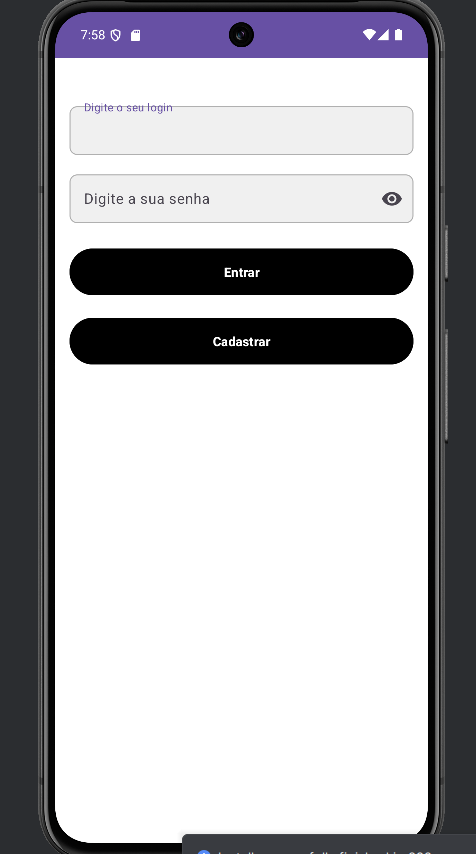
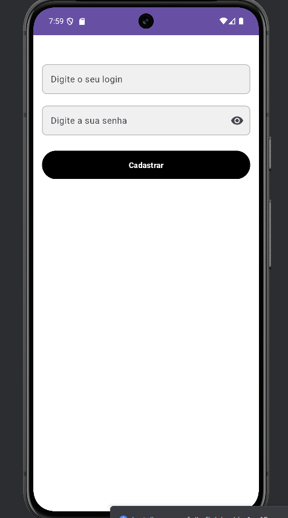
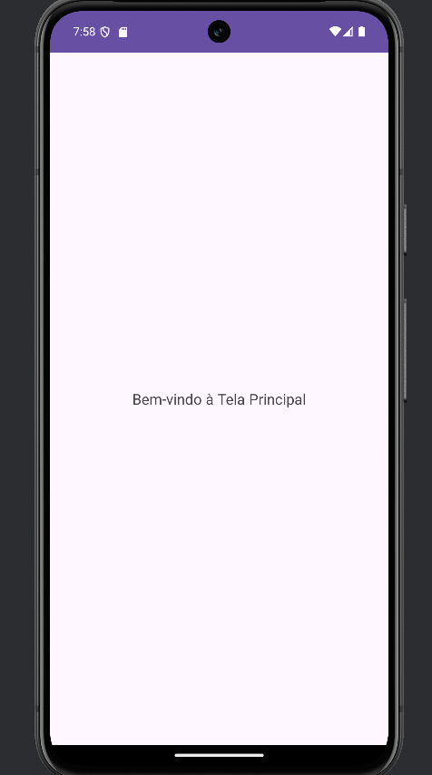

# 📱 Mobile App - Kotlin + Firebase

Este é um aplicativo mobile desenvolvido em **Kotlin** com a interface definida em **XML**, utilizando o **Firebase** como backend para funcionalidades como autenticação, banco de dados, e armazenamento.

---

## 📋 Funcionalidades

- **Autenticação de Usuários**
  - Login e cadastro com email e senha.
  - Login com provedores externos (Google, Facebook).
  
- **Gerenciamento de Dados**
  - Integração com o Firebase Realtime Database ou Firestore para armazenamento de dados.
  - Sincronização em tempo real.

- **Armazenamento de Arquivos**
  - Upload e download de imagens e outros arquivos usando o Firebase Storage.

- **Notificações Push**
  - Notificações em tempo real com Firebase Cloud Messaging (FCM).

- **Interface Responsiva**
  - Design em XML, otimizado para diferentes tamanhos de tela.

---

## 🛠️ Tecnologias Utilizadas

- **Linguagem:** Kotlin
- **Interface de Usuário:** XML
- **Backend-as-a-Service (BaaS):** Firebase
  - Firebase Authentication
  - Firebase Realtime Database / Firestore
  - Firebase Cloud Storage
  - Firebase Cloud Messaging (FCM)

---

## 🖼️ Capturas de Tela

| Tela de Login | Tela de Cadastro | Tela Principal |
|---------------|------------------|----------------|
|  |  |  |

---

## 🚀 Como Executar o Projeto

### Pré-requisitos
- [Android Studio](https://developer.android.com/studio) instalado.
- Conta no [Firebase Console](https://firebase.google.com/).

### Passos

1. **Clone o repositório**
   ```bash
   git clone https://github.com/seu-usuario/seu-repositorio.git
   cd seu-repositorio
